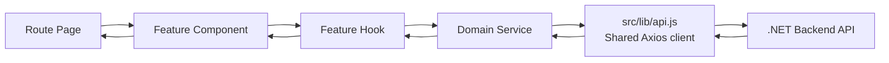

<<<<<<< HEAD
# DigiFikile LMS Frontend

> A patient, practical onboarding guide for interns and junior developers working in a feature-based React application.

## Table of contents

1. [Welcome: what this repository is](#1-welcome-what-this-repository-is)
2. [What you will learn](#2-what-you-will-learn)
3. [Mental model: feature-based frontend in plain English](#3-mental-model-feature-based-frontend-in-plain-english)
4. [How data flows through the application](#4-how-data-flows-through-the-application)
5. [Complete `src` folder map](#5-complete-src-folder-map)
6. [Anatomy of a feature module](#6-anatomy-of-a-feature-module)
7. [Pages vs features vs services](#7-pages-vs-features-vs-services)
8. [Routing](#8-routing)
9. [API integration](#9-api-integration)
10. [State management](#10-state-management)
11. [Coding rules for interns](#11-coding-rules-for-interns)
12. [Prerequisites, installation, and running](#12-prerequisites-installation-and-running)
13. [Add a new page and feature slice](#13-add-a-new-page-and-feature-slice)
14. [Connect a service method to the backend](#14-connect-a-service-method-to-the-backend)
15. [Implement a stub component safely](#15-implement-a-stub-component-safely)
16. [Frontend-to-backend domain map](#16-frontend-to-backend-domain-map)
17. [Testing checklist before a pull request](#17-testing-checklist-before-a-pull-request)
18. [Common mistakes and fixes](#18-common-mistakes-and-fixes)
19. [Troubleshooting](#19-troubleshooting)
20. [Suggested learning order](#20-suggested-learning-order)
21. [Use the file-header comments](#21-use-the-file-header-comments)

---

## 1. Welcome: what this repository is

Welcome to the **DigiFikile Learning Management System frontend**.

This package is named **`digifikile-lms-frontend`**. It is a React application that provides the browser user interface for learners, instructors, and administrators. It communicates with the DigiFikile **.NET backend API**, which is responsible for trusted business rules, validation, permissions, authentication, and database access.

This repository is currently a **scaffold**, not a finished production application. It deliberately contains:

- page shells;
- feature folders with placeholder components;
- hooks that return safe empty state;
- service methods that return empty values or throw `Error('Not implemented')`;
- `TODO` comments showing unfinished integration;
- detailed file-header comments explaining where implementation belongs.

For example, `fetchCourses()` currently resolves to an empty array, while other course service methods throw `Not implemented`. That is expected scaffold behaviour. Do not mistake an empty screen for proof that a real API request succeeded.

### Technology stack

| Concern | Technology | Purpose |
|---|---|---|
| User interface | React 19 | Builds component-based screens |
| Development/build tool | Vite 7 | Runs the dev server and creates production bundles |
| Styling | Tailwind CSS 4 | Applies mobile-first utility classes |
| Routing | React Router 7 | Maps browser URLs to page components |
| HTTP | Axios | Sends requests to the .NET API |
| Shared client state | React Context + `useReducer` | Holds the lightweight application store |
| Backend | .NET API | Owns persistence, validation, authorization, and domain rules |

### Important safety boundary

The frontend is an **untrusted client**. Anything shipped to the browser can be viewed or changed by a user.

The frontend may hide an admin button for a learner, but the backend must still reject an unauthorized admin request. The frontend may validate a form for convenience, but the backend must validate it again.

> Never place passwords, database credentials, signing keys, private API keys, or trusted authorization rules in this repository.

---

## 2. What you will learn

By working through this guide and the scaffold, you will learn how to:

1. understand a feature-based React architecture;
2. decide where new code belongs before writing it;
3. keep route pages small and easy to read;
4. separate UI, React orchestration, HTTP calls, and global state;
5. use feature `index.js` files as stable public APIs;
6. add and register routes safely;
7. use one shared Axios client instead of creating clients everywhere;
8. connect service stubs to .NET endpoints;
9. choose between local `useState`, a feature hook, and the global store;
10. implement loading, empty, error, and success states;
11. build accessible, mobile-first user interfaces;
12. test changes before opening a pull request;
13. diagnose common frontend/backend integration problems.

The most important habit is this:

> First decide which layer owns the responsibility. Then write the code in that layer.

---

## 3. Mental model: feature-based frontend in plain English

Imagine the application as a school building:

- **Pages** are rooms listed on the building map. A URL opens a room.
- **Features** are the teams doing real LMS work inside those rooms.
- **Feature components** display domain-specific UI, such as a course catalog.
- **Feature hooks** coordinate data, loading, errors, and user actions.
- **Services** are messengers that know how to speak to the backend.
- **`lib/api.js`** is the shared delivery vehicle used by every messenger.
- **The store** is a shared noticeboard for state needed far apart in the building.
- **Shared components** are reusable furniture such as buttons, cards, loaders, and navigation.
- **Constants** are the official directory: route names, endpoint paths, and site configuration.
- **Utilities** are small, pure tools such as date formatting and validation helpers.

### Organize by business area, not only by file type

Course code should be easy to find under `features/courses/`. Authentication code should be under `features/auth/`. Reporting code should be under `features/reports/`.

```text
features/
├── auth/          Everything specific to login, registration, and sessions
├── courses/       Course catalog, course detail, and course editing UI
├── content/       Modules, lessons, and lesson viewing
├── assessments/   Quizzes, assignments, and attempts
├── progress/      Completion and learner progress
├── reports/       Reporting and analytics UI
├── users/         User and role management UI
└── dashboard/     Role-aware dashboard UI
```

### The dependency direction

Higher-level UI layers may use lower-level infrastructure. Lower-level infrastructure must not import the UI that uses it.

```text
Page
  └── imports from a feature's index.js
        ├── Feature component
        └── Feature hook
              └── Domain service
                    └── Shared Axios client
                          └── .NET API
```

Keep arrows pointing downward. For example:

- a hook may import a service;
- a service must not import a hook;
- a page may import a feature;
- a service must not import a page;
- a feature component should not import raw Axios.

### Why this structure helps

Feature-based architecture:

- makes ownership obvious;
- reduces giant page files;
- prevents HTTP details from spreading through JSX;
- makes feature code easier to test;
- lets intern teams work in separate domains with fewer conflicts;
- gives reviewers a predictable place to find logic;
- makes later refactoring safer.

---

## 4. How data flows through the application

The normal read flow is:



In plain text:

```text
Page
  → Feature Component or Feature Hook
    → Service
      → src/lib/api.js Axios instance
        → .NET Backend

.NET Backend response
  → Axios instance
    → Service returns useful data
      → Hook updates loading/data/error
        → Component renders the correct UI state
```

### Example: loading the course catalog

1. React Router renders `CoursesPage`.
2. `CoursesPage` composes `CourseCatalog` from `features/courses/index.js`.
3. The courses feature calls `useCourses()`.
4. `useCourses()` calls `fetchCourses()` from `courseService.js`.
5. `fetchCourses()` calls `api.get(ENDPOINTS.COURSES.LIST)`.
6. `lib/api.js` applies the base URL, timeout, JSON header, and bearer token.
7. The .NET courses endpoint responds.
8. The service returns response data.
9. The hook stores the data or error and clears loading.
10. `CourseCatalog` renders a loader, error, empty state, or course cards.

### User action flow

Writes follow the same boundary:

```text
User clicks Submit
  → Feature component calls callback
    → Feature hook validates/orchestrates
      → Service sends DTO
        → .NET backend validates and authorizes
          → Hook handles success or ProblemDetails error
            → UI gives clear feedback
```

---

## 5. Complete `src` folder map

```text
src/
├── assets/                       Static imported assets and asset metadata
├── components/                   Reusable, cross-feature UI
│   ├── ui/                       Small visual primitives
│   ├── layout/                   Application shell and navigation
│   └── feedback/                 Loading, empty, warning, and error UI
├── constants/                    Shared immutable names and configuration
│   ├── api.js                    ENDPOINTS for backend paths
│   ├── routes.js                 ROUTES for browser paths
│   └── site.js                   Branding/navigation configuration
├── features/                     LMS domain modules
│   ├── auth/
│   ├── courses/
│   ├── content/
│   ├── assessments/
│   ├── progress/
│   ├── reports/
│   ├── users/
│   └── dashboard/
├── hooks/                        Hooks genuinely shared across features
│   └── useApi.js
├── lib/                          Shared framework/infrastructure setup
│   ├── api.js                    Configured Axios instance + interceptors
│   └── index.js                  Public lib exports
├── pages/                        Components mounted directly by routes
├── services/                     Endpoint-specific backend wrappers
│   ├── authService.js
│   ├── courseService.js
│   ├── contentService.js
│   ├── assessmentService.js
│   ├── progressService.js
│   ├── reportService.js
│   └── userService.js
├── store/                        Lightweight global client state
│   ├── index.jsx                 StoreProvider and useStore
│   └── slices/
│       ├── authSlice.js
│       ├── courseSlice.js
│       └── userSlice.js
├── styles/                       Design variables and custom global styles
├── utils/                        Pure reusable helper functions
│   ├── validators.js
│   ├── formatters.js
│   └── dateHelpers.js
├── App.jsx                       React Router composition
├── main.jsx                      Browser entry point and StoreProvider
└── index.css                     Global CSS/Tailwind entry
```

### Every folder explained

| Location | What belongs here | What does not belong here |
|---|---|---|
| `src/pages/` | One route-level screen per file; route params; layout composition; feature imports | Raw Axios calls, complex DTO mapping, large business workflows |
| `src/features/auth/` | Login/register/session UI and React-side auth orchestration | Course or reporting logic |
| `src/features/courses/` | Course catalog, detail, and editing components/hooks | Generic buttons or raw Axios configuration |
| `src/features/content/` | Course modules, lessons, and lesson viewer logic/UI | Assessment attempts |
| `src/features/assessments/` | Quiz/assessment lists, attempt forms, assessment hooks | General course catalog UI |
| `src/features/progress/` | Progress summaries, completion status, progress hooks | Report administration |
| `src/features/reports/` | Analytics/report components and report hooks | Generic chart infrastructure used everywhere, unless still report-specific |
| `src/features/users/` | User forms, lists, roles, role assignment | Auth token setup or site-wide navigation |
| `src/features/dashboard/` | Learner, instructor, and admin dashboard composition | Low-level API methods |
| `src/services/` | Named async methods for domain endpoints; transport mapping | React hooks, JSX, route navigation, component state |
| `src/store/` | State shared across distant routes or required through navigation | Every fetched API response and temporary input values |
| `src/store/slices/` | Initial state and reducer actions for auth/course/user global state | HTTP requests or UI |
| `src/components/ui/` | Reusable Button, Card, Badge-style primitives | Course-specific cards |
| `src/components/layout/` | Navbar, Sidebar, Footer, app-shell structure | Backend calls |
| `src/components/feedback/` | Loader, EmptyState, Alert-style reusable feedback | Domain-specific data fetching |
| `src/constants/` | Canonical routes, endpoint paths, site constants | Mutable state, functions with side effects, secrets |
| `src/lib/` | Shared Axios setup and other framework infrastructure | Endpoint-specific methods such as `fetchCourses` |
| `src/hooks/` | Hooks used meaningfully by multiple features | Hooks used only by one domain |
| `src/utils/` | Pure validation, formatting, and date helpers | React state, JSX, API calls |
| `src/assets/` | Images, fonts, icons, and importable static files | Sensitive documents or runtime data |
| `src/styles/` | Shared CSS variables and carefully chosen global styles | Large component-specific styling that Tailwind can express locally |
| `src/App.jsx` | Declarative route registration | Fetching, DTO transformations, page markup |
| `src/main.jsx` | Root render and application-wide providers | Feature logic or route-specific UI |

### Root files

- **`main.jsx`** finds the browser's `root` element, enables React `StrictMode`, wraps the app in `StoreProvider`, and renders `App`.
- **`App.jsx`** creates `BrowserRouter` and declares which page is rendered for each route.

Do not turn either bootstrap file into a general-purpose dumping ground.

---

## 6. Anatomy of a feature module

Every feature follows this basic shape:

```text
features/<feature-name>/
├── components/       UI that belongs specifically to this domain
├── hooks/            React orchestration for data, status, and actions
└── index.js          Public exports, also called a barrel
```

### Courses example

```text
features/courses/
├── components/
│   ├── CourseCatalog.jsx
│   ├── CourseCard.jsx
│   ├── CourseDetail.jsx
│   └── CourseForm.jsx
├── hooks/
│   ├── useCourses.js
│   └── useCourse.js
└── index.js
```

#### `components/`

These files render course-specific UI.

- `CourseCatalog` owns the course-list presentation.
- `CourseCard` displays one course summary.
- `CourseDetail` displays one course.
- `CourseForm` displays course create/edit inputs.

Components should receive data, callbacks, and status through props, or use a feature hook at a clear container boundary. They must not call raw Axios.

#### `hooks/`

Hooks coordinate React behaviour:

- call the correct service;
- own `loading`, `error`, and data state;
- run effects;
- expose actions such as `refetch`, `save`, or `remove`;
- ignore stale requests when dependencies change;
- optionally map transport data to UI-friendly view models.

A useful hook contract looks like:

```javascript
const {
  courses,
  loading,
  error,
  refetch,
} = useCourses()
```

The existing `useCourses` is still a stub. It returns an empty list, `loading: false`, `error: null`, and a no-op-style async `refetch`.

#### `index.js` barrel

The barrel is the feature's public door:

```javascript
export { default as CourseCatalog } from './components/CourseCatalog'
export { default as CourseCard } from './components/CourseCard'
export { useCourses } from './hooks/useCourses'
```

Pages should use:

```javascript
import { CourseCatalog } from '../features/courses'
```

Avoid:

```javascript
import CourseCatalog from '../features/courses/components/CourseCatalog'
```

The first import protects consumers from internal folder changes. Do not export every private helper “for convenience”; a barrel export becomes part of the feature contract.

### Feature module DO / DON'T

**DO**

- keep domain-specific code together;
- use named hook exports and clear component names;
- expose only approved public modules from `index.js`;
- keep all four async UI states explicit;
- keep components focused on presentation.

**DON'T**

- reach into another feature's internal folders;
- put API paths directly in components;
- import pages from features;
- hide side effects inside JSX rendering;
- create a generic abstraction before at least two real uses justify it.

---

## 7. Pages vs features vs services

Use this table before creating a file:

| If I need to… | Put it in… | Example |
|---|---|---|
| Make a component that React Router renders for `/courses` | `pages/` | `CoursesPage.jsx` |
| Read a route parameter and pass it downward | `pages/` | Read `courseId` in `CourseDetailPage` |
| Compose Navbar, Sidebar, Footer, and domain UI | `pages/` | `CoursesPage` composes `CourseCatalog` |
| Build UI only used for courses | `features/courses/components/` | `CourseCard.jsx` |
| Coordinate course requests/loading/errors | `features/courses/hooks/` | `useCourses.js` |
| Call `GET /courses` | `services/courseService.js` | `fetchCourses()` |
| Configure base URL, token, or generic interceptors | `lib/api.js` | Shared `api` Axios instance |
| Define `/courses` once for frontend navigation | `constants/routes.js` | `ROUTES.COURSES` |
| Define `/courses` once for backend HTTP requests | `constants/api.js` | `ENDPOINTS.COURSES.LIST` |
| Add a reusable visual button | `components/ui/` | `Button.jsx` |
| Add a reusable error or loading view | `components/feedback/` | `Alert.jsx`, `Loader.jsx` |
| Add app navigation or shell UI | `components/layout/` | `Navbar.jsx` |
| Share authenticated user state across routes | `store/slices/authSlice.js` | `auth/setUser` |
| Hold one modal's open/closed state | Local `useState` | `const [open, setOpen] = useState(false)` |
| Format dates without side effects | `utils/dateHelpers.js` | `formatDate(...)` |
| Add a hook used only by reports | `features/reports/hooks/` | `useReports.js` |
| Add a hook truly used across several features | `hooks/` | `useApi.js` |
| Add an image imported by components | `assets/` | Logo or illustration |

### Quick decision tree

```text
Is the file mounted directly by a route?
├── Yes → pages/
└── No
    Is it specific to one LMS domain?
    ├── Yes
    │   ├── Renders UI? → features/<domain>/components/
    │   └── Coordinates React data/actions? → features/<domain>/hooks/
    └── No
        ├── Calls a backend endpoint? → services/
        ├── Reusable UI? → components/
        ├── Pure transformation? → utils/
        ├── Shared constant? → constants/
        └── Global infrastructure? → lib/
```

---

## 8. Routing

Routing has two sources that must agree:

1. `src/constants/routes.js` defines canonical browser paths in `ROUTES`.
2. `src/App.jsx` registers those paths with React Router and page components.

### Existing routes

| Route constant/pattern | URL | Page | Current access state |
|---|---|---|---|
| `ROUTES.HOME` | `/` | `HomePage` | Public |
| `ROUTES.LOGIN` | `/login` | `LoginPage` | Public |
| `ROUTES.REGISTER` | `/register` | `RegisterPage` | Public |
| `ROUTES.DASHBOARD` | `/dashboard` | `DashboardPage` | Guard TODO |
| `ROUTES.COURSES` | `/courses` | `CoursesPage` | Guard TODO |
| `ROUTES.COURSE_DETAIL(courseId)` | `/courses/:courseId` | `CourseDetailPage` | Registered as a dynamic pattern |
| `ROUTES.ASSESSMENTS` | `/assessments` | `AssessmentsPage` | Guard TODO |
| `ROUTES.PROGRESS` | `/progress` | `ProgressPage` | Guard TODO |
| `ROUTES.REPORTS` | `/reports` | `ReportsPage` | Admin/instructor guard TODO |
| `ROUTES.USERS` | `/users` | `UsersPage` | Admin guard TODO |
| `ROUTES.NOT_FOUND` / `*` | Any unmatched path | `NotFoundPage` | Public fallback |

`ROUTES.COURSE_DETAIL` is a function:

```javascript
ROUTES.COURSE_DETAIL()       // '/courses/:courseId' for route registration
ROUTES.COURSE_DETAIL('123')  // '/courses/123' for navigation
```

`App.jsx` currently registers the detail route with a literal `/courses/:courseId`. Prefer the route constant when modifying this area so there is one source of truth.

### Adding a route safely

1. Add the canonical path to `ROUTES`.
2. Create the page in `src/pages/`.
3. Import the page in `App.jsx`.
4. Add a `<Route>` using the constant.
5. Add navigation configuration in `constants/site.js` if users need a visible link.
6. Decide whether the route is public, authenticated, or role-restricted.
7. Test direct browser navigation and in-app navigation.
8. Test an unknown URL still reaches `NotFoundPage`.

### `ProtectedRoute` is not implemented yet

The current private-looking routes are **not yet protected in the browser**. `App.jsx` contains TODOs for:

- authenticated-route protection;
- admin/instructor reports protection;
- admin-only user-management protection.

A future `ProtectedRoute` should:

1. read session state;
2. show a pending/loading state while session status is unknown;
3. render children when allowed;
4. redirect with `ROUTES.LOGIN` when unauthenticated;
5. show an appropriate forbidden state when the user lacks a role.

Frontend guards improve user experience but are not security boundaries. The .NET backend must enforce authorization on every protected endpoint.

---

## 9. API integration

### Base URL

Create a local `.env` file in `DigiFikile-LMS.Frontend/`:

```env
VITE_API_BASE_URL=http://localhost:5000/api
```

Only variables prefixed with `VITE_` are exposed through `import.meta.env` by Vite. The Axios client currently falls back to:

```text
http://localhost:5000/api
```

Important:

- restart `npm run dev` after changing `.env`;
- do not commit real secrets;
- Vite environment variables are compiled into browser code and are not private;
- avoid a trailing slash if endpoints begin with `/`, unless your backend setup explicitly expects it.

### Shared Axios client: `src/lib/api.js`

The shared `api` instance currently configures:

| Setting | Current behaviour |
|---|---|
| `baseURL` | `VITE_API_BASE_URL` or `http://localhost:5000/api` |
| Timeout | 10 seconds |
| Content type | `application/json` |
| Request interceptor | Reads `token` from `localStorage` and adds `Authorization: Bearer <token>` |
| Response interceptor | Detects `401`; clearing auth state and redirecting are still TODOs |

Use this instance from services. Do not call `axios.get(...)` directly in pages or components, and do not create a new Axios instance per service.

### Endpoint constants

Backend paths live in `src/constants/api.js` under `ENDPOINTS`:

```javascript
ENDPOINTS.AUTH.LOGIN
ENDPOINTS.COURSES.LIST
ENDPOINTS.COURSES.BY_ID(courseId)
ENDPOINTS.CONTENT.MODULES(courseId)
ENDPOINTS.ASSESSMENTS.SUBMIT(assessmentId)
ENDPOINTS.PROGRESS.BY_USER(userId)
ENDPOINTS.REPORTS.DASHBOARD
ENDPOINTS.USERS.BY_ID(userId)
ENDPOINTS.ROLES.ASSIGN(userId)
```

Do not repeat path strings in service methods. If the backend route changes, one constant should be updated.

### Service inventory

| Service | Domain responsibility |
|---|---|
| `authService.js` | Login, registration, logout/refresh/session operations |
| `courseService.js` | Course list, detail, create, update, delete |
| `contentService.js` | Course modules and lessons |
| `assessmentService.js` | Assessments and attempts |
| `progressService.js` | Learner/course progress and completion |
| `reportService.js` | Dashboard and analytics reports |
| `userService.js` | Users, roles, and role assignment |

These files are scaffold boundaries. Their methods currently return empty values or throw `Not implemented`. Confirm the real controller route and DTO before replacing a stub.

### Error handling

Axios rejects non-success responses. Preserve useful backend information:

```javascript
try {
  await createCourse(values)
} catch (error) {
  const problem = error.response?.data
  // Show a safe summary and field validation messages when available.
}
```

Do not convert every failure to “Something went wrong” too early. The .NET API may return ProblemDetails or field-level validation errors that the form needs.

---

## 10. State management

The application uses a lightweight React Context + `useReducer` store.

`main.jsx` wraps the application:

```text
StrictMode
└── StoreProvider
    └── App
```

Consumers use:

```javascript
import { useStore } from '../store'

const { state, dispatch } = useStore()
```

### Existing slices

| Slice | Current fields | Intended use |
|---|---|---|
| `authSlice` | `user`, `token`, `isAuthenticated`, `loading` | Session state shared across the application |
| `courseSlice` | `courses`, `selectedCourseId`, `loading` | Scaffolded course state; prefer feature-owned server data unless cross-route sharing is proven |
| `userSlice` | `users`, `roles`, `loading` | Scaffolded user/role state when distant consumers genuinely need it |

Reducers respond to action names such as:

```javascript
dispatch({ type: 'auth/setUser', payload: user })
dispatch({ type: 'auth/setToken', payload: token })
dispatch({ type: 'auth/logout' })
dispatch({ type: 'course/setSelectedCourseId', payload: courseId })
dispatch({ type: 'user/setRoles', payload: roles })
```

### Store vs local state vs feature hook

| Situation | Best home | Why |
|---|---|---|
| Input text in one form | Local `useState` | Only that component needs it |
| One modal's open/closed state | Local `useState` | Temporary UI detail |
| Course list loading/error/data | `useCourses` feature hook | Server-data orchestration belongs near the feature |
| Current course detail | `useCourse` feature hook | Tied to course route/data lifecycle |
| Authenticated user used by Navbar and protected routes | Global store | Distant parts of the app need it |
| Selected course ID needed across routes | Global store, if truly required | Must survive route changes |
| A value calculated from existing state | Calculate it | Avoid duplicated derived state |

### Rule of thumb

Start local. Move state to a feature hook when it coordinates a feature. Move it to the global store only when multiple distant consumers or route transitions need the same client state.

**DO**

- define a clear initial state;
- use narrowly named actions;
- reset session-related state on logout;
- keep loading/error semantics explicit;
- derive values instead of storing duplicates.

**DON'T**

- put every API response in the global store;
- maintain the same data in a hook and store without a synchronization plan;
- treat `localStorage` as secure;
- dispatch HTTP requests from reducers;
- mutate existing state objects.

---

## 11. Coding rules for interns

### Architecture rules

1. **One responsibility per file.** If a file fetches data, formats five DTOs, renders a page, and handles navigation, split it.
2. **No Axios in pages or components.** Endpoint calls belong in `services/`.
3. **Use feature hooks for React orchestration.** Hooks own loading, error, effects, and refetching.
4. **Use `ROUTES` for frontend URLs.** Do not hardcode `/dashboard` throughout JSX.
5. **Use `ENDPOINTS` for backend paths.** Do not hardcode `/api/courses`.
6. **Import feature code through `features/<name>/index.js`.**
7. **Do not import pages into features or services.**
8. **Keep backend authorization authoritative.**

### UI and accessibility rules

1. Use semantic elements: `<main>`, `<nav>`, `<header>`, `<form>`, `<button>`.
2. Each page should have one logical `<h1>`.
3. Associate every form input with a visible `<label>`.
4. Use real `<button>` elements, not clickable `<div>` elements.
5. Set button `type="button"` unless it should submit a form.
6. Ensure keyboard users can perform every action.
7. Do not remove focus outlines without an accessible replacement.
8. Add `aria-*` only when native HTML does not already express the meaning.
9. Use stable domain IDs as React list keys; do not use array indexes for changing lists.

### Tailwind and responsive design rules

Build **mobile-first**:

```jsx
<section className="grid gap-4 md:grid-cols-2 lg:grid-cols-3">
```

The unprefixed classes apply to small screens. Breakpoint-prefixed classes enhance larger screens.

**DO**

- use flexible widths and content-driven height;
- verify narrow mobile screens;
- use consistent spacing;
- use shared design variables where provided;
- keep readable color contrast.

**DON'T**

- assume every user has a desktop monitor;
- use fixed widths that overflow phones;
- hide essential actions only on small screens;
- communicate state by color alone;
- create arbitrary styles when an existing shared component fits.

### Async UI states are mandatory

Every data-driven screen must deliberately render:

| State | Expected UI |
|---|---|
| Loading | Loader/skeleton and suitable status text |
| Error | Understandable message and retry action where useful |
| Empty | Explain that no records exist and suggest the next action |
| Success | Render the data |

An empty array is not the same as loading. A `401` is not the same as an empty list.

### Security rules

- Never store passwords.
- Never commit `.env` files containing credentials.
- Never put database connection strings in frontend code.
- Never trust a user ID or role supplied by the browser.
- Never assume hiding UI prevents an API request.
- Avoid rendering untrusted HTML.
- Do not log tokens or sensitive learner data.
- Keep production secrets on the backend or in secure deployment configuration.

---

## 12. Prerequisites, installation, and running

### Prerequisites

- **Node.js 18 or newer**; Node 20 LTS is recommended.
- **npm**, installed with Node.
- Git and a code editor.
- The .NET backend when testing real API integration.

Check versions:

```bash
node --version
npm --version
```

### Install

Open a terminal in `DigiFikile-LMS.Frontend/`:

```bash
npm install
```

This reads `package.json` and installs dependencies into `node_modules/`. Do not edit files inside `node_modules/`.

### Configure the API

Create `.env` beside `package.json`:

```env
VITE_API_BASE_URL=http://localhost:5000/api
```

Use the actual HTTPS/HTTP address printed by the backend when it starts if it differs.

### Start development

```bash
npm run dev
```

Vite prints the local URL, commonly `http://localhost:5173`. It also provides hot module replacement, so most saved changes appear without a manual restart.

### Production build

```bash
npm run build
```

This validates that Vite can produce deployable static files. A development page working in the browser does not guarantee the production build succeeds.

### Preview the production build

```bash
npm run preview
```

Run `npm run build` first. Preview serves the built output locally; it is not the production deployment command.

### Available scripts

| Command | Purpose |
|---|---|
| `npm run dev` | Start Vite development server |
| `npm run build` | Create a production bundle |
| `npm run preview` | Serve the production bundle locally |

There are currently no test or lint scripts in `package.json`. Do not claim automated tests passed unless the project adds and runs them.

---

## 13. Add a new page and feature slice

This example adds an **Announcements** area. “Feature slice” here means a new feature module, not automatically a global store slice.

### Step 1: confirm the requirement

Before coding, answer:

1. Who can view announcements?
2. What backend controller/route exists?
3. Is this one page or several routes?
4. Which loading, empty, error, and success states are required?
5. Does any state genuinely need to be global?

Do not invent a backend contract silently.

### Step 2: create the feature structure

```text
src/features/announcements/
├── components/
│   ├── AnnouncementList.jsx
│   └── AnnouncementCard.jsx
├── hooks/
│   └── useAnnouncements.js
└── index.js
```

### Step 3: create a service boundary

Create:

```text
src/services/announcementService.js
```

Start with an explicit stub if the backend is not ready:

```javascript
export const fetchAnnouncements = async () => {
  throw new Error('Not implemented')
}
```

Do not return fake production data without clearly marking it as fixture/mock data.

### Step 4: add endpoint constants

Add the confirmed backend routes to `ENDPOINTS`:

```javascript
ANNOUNCEMENTS: {
  LIST: '/announcements',
  BY_ID: (announcementId) => `/announcements/${announcementId}`,
},
```

### Step 5: implement the feature hook

`useAnnouncements` should:

- start with a clear loading state;
- call `fetchAnnouncements`;
- store data or an actionable error;
- stop loading in all outcomes;
- protect against stale updates after unmount;
- return a small documented contract.

Example contract:

```javascript
return {
  announcements,
  loading,
  error,
  refetch,
}
```

### Step 6: implement feature components

`AnnouncementList` should render:

1. loader while loading;
2. alert and retry button on error;
3. empty-state message when the array is empty;
4. an accessible list of `AnnouncementCard` items on success.

### Step 7: export the feature's public API

```javascript
export { default as AnnouncementList } from './components/AnnouncementList'
export { useAnnouncements } from './hooks/useAnnouncements'
```

### Step 8: create a thin page

Create `src/pages/AnnouncementsPage.jsx`. It should compose layout and import from the feature barrel:

```javascript
import { AnnouncementList } from '../features/announcements'
```

Do not copy service logic into the page.

### Step 9: add and register the route

Add:

```javascript
ANNOUNCEMENTS: '/announcements',
```

to `ROUTES`, then import and register `AnnouncementsPage` in `App.jsx`.

### Step 10: add navigation if required

Update `constants/site.js` rather than hardcoding another independent navigation path.

### Step 11: decide whether a store slice is justified

Do **not** add `announcementSlice.js` merely because other slices exist. Add global state only if multiple distant routes need the same client state or it must survive route changes. Server data can remain in `useAnnouncements`.

### Full checklist

- [ ] Requirement and backend contract confirmed
- [ ] Feature directory created
- [ ] Components placed under the feature
- [ ] Feature hook created
- [ ] `index.js` exports only public modules
- [ ] Service created
- [ ] `ENDPOINTS` updated
- [ ] Page created and kept thin
- [ ] `ROUTES` updated
- [ ] Route registered in `App.jsx`
- [ ] Correct auth/role guard planned
- [ ] Navigation updated if needed
- [ ] Loading state implemented
- [ ] Empty state implemented
- [ ] Error and retry state implemented
- [ ] Success state implemented
- [ ] Mobile and keyboard behaviour checked
- [ ] Production build run

---

## 14. Connect a service method to the backend

Never wire a service from endpoint guesses alone. Inspect the .NET controller, request DTO, response DTO, authentication attributes, and route template.

### Example: replace the `fetchCourses` stub

Current scaffold behaviour:

```javascript
export const fetchCourses = async () => {
  return Promise.resolve([])
}
```

Target pattern:

```javascript
import { ENDPOINTS } from '../constants/api'
import { api } from '../lib'

export const fetchCourses = async () => {
  const { data } = await api.get(ENDPOINTS.COURSES.LIST)
  return data
}
```

Confirm whether the real API returns:

- a plain array;
- `{ items, totalCount }`;
- paged values with query parameters;
- PascalCase or camelCase fields;
- nullable values;
- ProblemDetails on errors.

### Detailed integration steps

1. **Read the backend controller.** Confirm HTTP method and route.
2. **Read the DTOs.** Confirm field names, types, nullability, and validation.
3. **Check authorization.** Determine whether a bearer token and role are required.
4. **Add or verify `ENDPOINTS`.** Use a function for route parameters.
5. **Import the shared `api`.** Never create another Axios client.
6. **Give the service explicit parameters.** For example, `fetchCourseById(courseId)`.
7. **Validate required caller input where useful.** Fail clearly for an absent ID.
8. **Call the correct Axios method.** `get`, `post`, `put`, `patch`, or `delete`.
9. **Send the DTO in the correct place.** Body for writes; `params` for query strings.
10. **Return useful data.** Usually return `response.data`, not the full response.
11. **Preserve errors.** Let Axios errors reach the feature hook unless adding meaningful transport mapping.
12. **Update the feature hook.** Connect the service and all UI states.
13. **Test success and failure.** Include unauthorized and validation cases.

### Parameterized example

```javascript
export const fetchCourseById = async (courseId) => {
  if (!courseId) {
    throw new Error('courseId is required')
  }

  const { data } = await api.get(ENDPOINTS.COURSES.BY_ID(courseId))
  return data
}
```

### Create example

```javascript
export const createCourse = async (courseDto) => {
  const { data } = await api.post(ENDPOINTS.COURSES.CREATE, courseDto)
  return data
}
```

Use the backend's real DTO. Do not send the entire component state if it includes UI-only fields.

### Service integration DO / DON'T

**DO**

- use `api` from `lib`;
- use `ENDPOINTS`;
- match backend HTTP verbs and DTOs;
- return documented, useful values;
- preserve backend validation details;
- encode query values through Axios `params`.

**DON'T**

- call `axios` directly in JSX;
- swallow all errors and return `[]`;
- convert `401` into “no courses”;
- invent endpoint paths;
- trust frontend role checks;
- log tokens or sensitive response bodies.

---

## 15. Implement a stub component safely

Use `CourseCatalog` as the model. It currently renders:

```text
TODO: Course catalog — grid of CourseCard components
```

### Safe implementation process

1. **Read the entire file-header comment.** It describes the component's layer and boundaries.
2. **Read the feature hook.** Understand its current return contract.
3. **Read the service.** Determine whether it is still a stub.
4. **Read shared feedback components.** Reuse `Loader`, `EmptyState`, or `Alert` where appropriate.
5. **Define component responsibility.** The catalog displays a collection; one card displays one course.
6. **Decide where the hook is called.** Use one clear container boundary.
7. **Implement loading first.**
8. **Implement error and retry.**
9. **Implement empty state.**
10. **Implement success using stable IDs as keys.**
11. **Check accessible headings, links, and buttons.**
12. **Check mobile layout before desktop enhancements.**
13. **Do not remove scaffold comments that still explain important architecture.**

### Recommended shape

```jsx
export default function CourseCatalog() {
  const { courses, loading, error, refetch } = useCourses()

  if (loading) return <Loader label="Loading courses…" />
  if (error) return <Alert message="Courses could not be loaded." onRetry={refetch} />
  if (courses.length === 0) return <EmptyState message="No courses are available yet." />

  return (
    <section aria-labelledby="course-catalog-heading">
      <h2 id="course-catalog-heading">Available courses</h2>
      <div className="grid gap-4 md:grid-cols-2 lg:grid-cols-3">
        {courses.map((course) => (
          <CourseCard key={course.id} course={course} />
        ))}
      </div>
    </section>
  )
}
```

Treat this as a structural example. Verify the actual shared component props and backend course ID field before copying it.

### Avoid accidental architecture breaks

- Do not put `api.get(...)` in `CourseCatalog`.
- Do not put all card markup inside `CoursesPage`.
- Do not import another feature's private component path.
- Do not treat a service's stubbed empty array as real backend data.
- Do not add a global store dependency unless needed.
- Do not delete error handling because the happy path works locally.

---

## 16. Frontend-to-backend domain map

The frontend features and services correspond to .NET API controller areas:

| Frontend feature/service | Main backend controller or domain | Typical responsibility |
|---|---|---|
| `features/auth`, `authService` | `AuthController` | Login, registration, current session, token lifecycle |
| `features/courses`, `courseService` | `CoursesController` | Course catalog, detail, create, update, delete |
| `features/courses` | `EnrollmentsController` | Course enrollment workflows where applicable |
| `features/content`, `contentService` | `ModulesController` | Course module structure |
| `features/content`, `contentService` | `LessonsController` | Lesson metadata and content |
| `features/assessments`, `assessmentService` | `AssessmentsController` | Assessments, attempts, and submission |
| `features/progress`, `progressService` | `ProgressController` | Learner/course progress and completion |
| `features/reports`, `reportService` | `ReportsController` | Dashboard reporting and analytics |
| `features/users`, `userService` | `UsersController` | User listing and administration |
| `features/users`, `userService` | `RolesController` | Roles and role assignment |
| `features/dashboard` | Several controllers | Role-aware summary data composed from domain APIs |

This is an ownership map, not proof that every frontend endpoint constant exactly matches an implemented backend action. Always inspect the current controller before integration.

### Cross-domain workflows

Some screens combine domains. A course detail page might display course information, modules, enrollment status, and progress. Do not merge all services into one giant course service.

Prefer:

```text
CourseDetailPage
├── Courses public feature API
├── Content public feature API
└── Progress public feature API
```

Coordinate through page composition or a clearly named workflow hook while preserving each domain's service boundary.

---

## 17. Testing checklist before a pull request

### Build and startup

- [ ] `npm install` succeeds with the committed lockfile
- [ ] `npm run dev` starts without runtime errors
- [ ] `npm run build` succeeds
- [ ] Browser console has no new errors or repeated warnings

### Routing

- [ ] New route opens directly from the address bar
- [ ] In-app navigation uses `ROUTES`
- [ ] Browser refresh works on the route in the target hosting environment
- [ ] Unknown routes still show `NotFoundPage`
- [ ] Route parameters work with valid and invalid IDs
- [ ] Auth/role behaviour matches the current implementation and TODO status

### API integration

- [ ] Service uses the shared `api` instance
- [ ] Service uses `ENDPOINTS`
- [ ] HTTP method matches the controller
- [ ] Request body/query/route values match the DTO
- [ ] Success response shape is handled
- [ ] Validation response is visible to the user
- [ ] `401` is not shown as empty data
- [ ] `403`, `404`, `409`, and server errors are handled appropriately
- [ ] No token or sensitive data is logged

### User interface

- [ ] Loading state works
- [ ] Empty state works
- [ ] Error state works
- [ ] Retry works where offered
- [ ] Success state works
- [ ] Long text does not break the layout
- [ ] Mobile-width layout works
- [ ] Keyboard navigation works
- [ ] Inputs have labels
- [ ] Buttons have the correct type
- [ ] Focus is visible
- [ ] Color contrast is readable

### Architecture

- [ ] Page remains thin
- [ ] No Axios call appears in pages/components
- [ ] Domain code is in the correct feature
- [ ] Feature consumers import through `index.js`
- [ ] No unnecessary global state was added
- [ ] No route or endpoint strings were duplicated
- [ ] File names and exports follow existing conventions
- [ ] Existing file-header guidance was respected

### Pull request quality

- [ ] PR description explains what and why
- [ ] Screenshots are included for visible UI changes
- [ ] Manual test steps are listed
- [ ] Known TODOs or backend dependencies are stated
- [ ] Change is focused and does not include unrelated refactoring

---

## 18. Common mistakes and fixes

| Mistake | Why it causes trouble | Fix |
|---|---|---|
| Calling Axios in a page | Mixes routing, UI, and transport concerns | Move call to a service and orchestration to a feature hook |
| Calling Axios in a component | Makes UI difficult to test and reuse | Pass data/callbacks or use a feature hook |
| Hardcoding `/courses` | Creates multiple sources of truth | Use `ROUTES.COURSES` or `ENDPOINTS.COURSES.LIST` depending on purpose |
| Confusing route and endpoint constants | Browser URLs and API URLs solve different problems | `ROUTES` navigates; `ENDPOINTS` calls backend |
| Importing feature internals | Couples callers to folder structure | Export from and import through `features/<name>/index.js` |
| Putting every value in the store | Creates synchronization and stale-data bugs | Keep temporary state local and server orchestration in hooks |
| Treating `[]` as successful API data | Scaffold stubs can look like real empty results | Inspect the service and implement the actual request |
| Catching errors and returning `[]` | Hides outages and authorization failures | Preserve error state and render it |
| Using array index as a key | Wrong component state may follow reordered rows | Use stable backend IDs |
| Using a clickable `<div>` | Breaks keyboard and semantic accessibility | Use `<button>` or `<a>` |
| Desktop-only fixed widths | Layout breaks on phones | Start with flexible mobile layout and add breakpoints |
| Adding role checks only in React | Users can still send requests manually | Enforce permissions in .NET; frontend checks are UX only |
| Adding secrets to `.env` | `VITE_` values are visible in browser bundles | Keep secrets on the backend |
| Editing `lib/api.js` for one endpoint | Turns shared infrastructure into a domain service | Put endpoint methods in the correct service |
| Adding logic to `index.js` barrels | Makes import boundaries unpredictable | Keep barrels to deliberate exports |
| Changing a backend DTO in JSX | Spreads transport assumptions through UI | Map in service or feature hook |

---

## 19. Troubleshooting

### CORS error

**Symptoms**

- Browser console mentions “blocked by CORS policy”.
- Request may work in Swagger/Postman but not in the browser.

**Why**

The backend has not allowed the frontend origin, such as `http://localhost:5173`, or the HTTP/HTTPS origins do not match configured policy.

**Check**

1. Confirm the exact frontend origin printed by Vite.
2. Confirm the exact backend URL.
3. Inspect backend CORS configuration.
4. Ensure allowed origins include protocol, host, and port.
5. Restart the backend after configuration changes.

Do not “fix” CORS by disabling browser security or using an unsafe wildcard policy in production.

### `401 Unauthorized`

**Symptoms**

- API responds with status 401.
- Protected data does not load.

**Check**

1. Was login actually connected, or is it still a stub?
2. Does `localStorage.getItem('token')` contain a current token?
3. Does the request include `Authorization: Bearer ...`?
4. Has the token expired?
5. Does the backend use the same authentication scheme?
6. Is `VITE_API_BASE_URL` pointing to the expected backend?

The response interceptor detects 401, but clearing auth state and redirecting are still TODOs. Do not assume automatic logout is implemented.

### `403 Forbidden`

Authentication succeeded, but the current user lacks permission. Check backend role/policy requirements. Do not relabel 403 as 401 or hide it as an empty list.

### Blank page

**Check in order**

1. Open browser developer tools.
2. Read the first console error.
3. Check the terminal running Vite.
4. Confirm `main.jsx` can find `<div id="root">` in `index.html`.
5. Check import paths and default/named export mismatches.
6. Confirm the route renders the intended page.
7. Check for undefined data used before loading completes.
8. Run `npm run build` for a clearer compilation failure.

Common import mismatch:

```javascript
// Named export
export const useCourses = () => {}
import { useCourses } from './hooks/useCourses'

// Default export
export default function CourseCatalog() {}
import CourseCatalog from './components/CourseCatalog'
```

### Environment variable appears ignored

1. Ensure the file is named `.env` and is beside `package.json`.
2. Ensure the variable begins with `VITE_`.
3. Use exactly `VITE_API_BASE_URL`.
4. Restart the Vite dev server.
5. Check for extra quotes, spaces, or a wrong port.
6. Inspect the request URL in the Network panel.

Remember that the current code uses the default URL when the variable is absent.

### Network error or timeout

`lib/api.js` times out after 10 seconds.

Check:

- backend is running;
- host and port are correct;
- HTTP vs HTTPS is correct;
- local development certificate is trusted;
- firewall/VPN is not blocking the connection;
- API route includes the expected `/api` prefix;
- backend did not hang while accessing its database.

### Data is always empty

Before debugging rendering, inspect the service. Many scaffold methods intentionally return `[]` or other empty values. Connect the service to the API, then connect the hook to the service.

### “Not implemented” error

This usually means a scaffold service method was called before integration. Find the service method, verify the backend contract, and follow [Connect a service method to the backend](#14-connect-a-service-method-to-the-backend).

### Changes happen twice in development

`main.jsx` uses React `StrictMode`. React may intentionally re-run certain development lifecycle behaviour to reveal unsafe side effects. Effects should be resilient and clean up requests/listeners. Do not remove `StrictMode` just to hide an effect bug.

---

## 20. Suggested learning order

Do not try to implement every domain at once. This sequence builds concepts gradually.

### 1. Login and authentication

Learn:

- controlled forms;
- auth service methods;
- token handling;
- auth store actions;
- session loading;
- future `ProtectedRoute` behaviour;
- 401 handling.

Completion target: a user can log in, session state is represented clearly, and logout resets it safely.

### 2. Courses catalog

Learn:

- collection fetching;
- `useCourses`;
- loading/error/empty/success UI;
- course cards;
- responsive grid;
- route links using `ROUTES`.

Completion target: real courses display from the backend.

### 3. Course detail and content

Learn:

- dynamic `courseId` route parameters;
- `useCourse`;
- modules and lessons;
- composing multiple domain features;
- handling invalid/missing records.

Completion target: a course route displays its metadata and content structure.

### 4. Assessments

Learn:

- forms with stronger validation;
- attempts and submissions;
- server validation;
- preventing accidental duplicate submissions;
- result feedback.

Completion target: a learner can complete the supported assessment workflow.

### 5. Progress

Learn:

- progress view models;
- completion states;
- learner vs instructor perspectives;
- refreshing after relevant actions.

Completion target: progress is understandable and reflects backend truth.

### 6. Reports and users

Learn:

- role-aware UI;
- larger datasets;
- analytics presentation;
- user/role administration;
- 403 handling;
- backend-enforced permissions.

Completion target: authorized roles can access appropriate administration features, while unauthorized users receive clear safe feedback.

---

## 21. Use the file-header comments

Most scaffold files begin with detailed comments. Read them **before editing the file**.

Headers commonly explain:

- `@layer` — which architectural layer owns the file;
- **WHAT THIS FILE IS** — its single responsibility;
- **WHY THIS FOLDER** — why it belongs at that path;
- **HOW TO CODE HERE** — implementation rules;
- **DO NOT** — common boundary violations;
- **RELATED FILES** — nearby code to inspect;
- **DIGIFIKILE LMS CONTEXT** — domain and security expectations;
- `@example` — a small usage example.

### Recommended reading routine

When assigned a task:

1. Read the page header.
2. Read the owning feature's `index.js`.
3. Read the relevant feature component and hook headers.
4. Read the service header.
5. Read `constants/api.js` or `constants/routes.js` as relevant.
6. Read the matching .NET controller and DTOs before API integration.
7. Write down which layer will change.
8. Implement the smallest complete vertical slice.
9. verify loading, error, empty, and success states.
10. run the pre-PR checklist.

### Final “where does this go?” reminder

```text
Browser URL screen?                 → pages/
Domain-specific UI?                 → features/<domain>/components/
Domain React data/actions?          → features/<domain>/hooks/
Backend operation?                  → services/
Shared Axios configuration?         → lib/api.js
Frontend path?                      → constants/routes.js
Backend path?                       → constants/api.js
Cross-route client state?           → store/
Temporary component state?          → local useState
Reusable cross-feature UI?          → components/
Pure formatting/validation?         → utils/
```

If you are still uncertain, ask a reviewer **before** creating a new abstraction or placing the same logic in multiple layers.

---

## Quick safety summary

**DO**

- keep pages thin;
- keep features domain-focused;
- keep HTTP calls in services;
- use the shared Axios client;
- use `ROUTES` and `ENDPOINTS`;
- show all async states;
- build mobile-first and accessibly;
- verify the .NET contract;
- run `npm run build` before a PR;
- treat backend authorization as authoritative.

**DON'T**

- assume scaffold stubs are real integrations;
- put Axios in pages/components;
- duplicate paths;
- expose secrets;
- trust browser roles or IDs;
- swallow API errors;
- put all server data in global state;
- bypass feature barrels;
- mix unrelated refactoring into a focused task.

Welcome to the project. Work in small vertical slices, preserve the layer boundaries, and ask early when the backend contract or ownership is unclear.
=======
# Digifikile-Frontend-LMS-Integrated
>>>>>>> 28b3df4265cd1ded16d7039a3ec6640802feef3a
